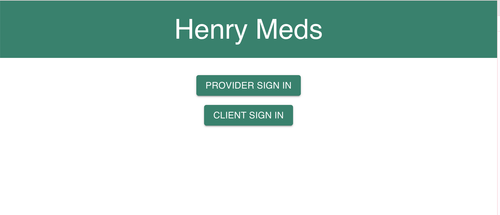
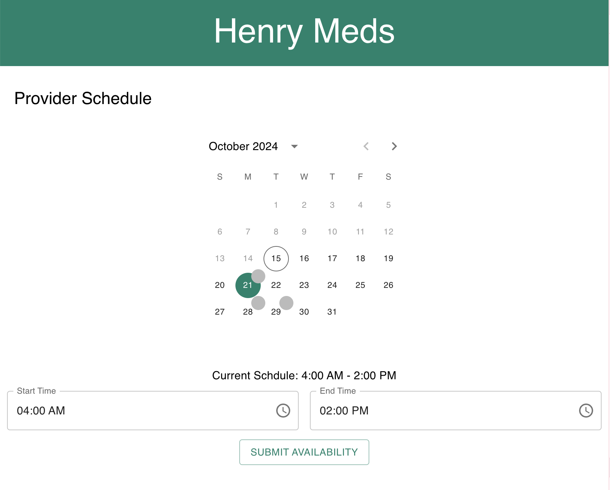
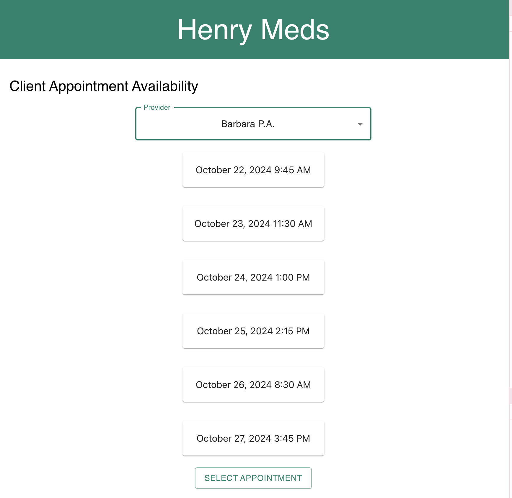
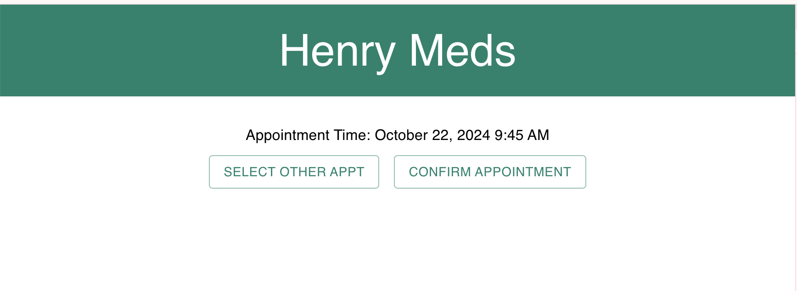

# Henry Meds Scheduling App

This app allows providers to create a schedule of their availability and clients to 
schedule an appointment.

This page allows users to see the flow of the provider or the client

The Provider Scheduling page allows providers to see what dates they already have  scheduled on their calendar and click on the dates to change or add availability to their schedule.

The Client Schedule page allows clients to see the available times for a list of providers.  They can pick an appointment and then are taken to the confirm page.

The confirm page shows the appointment time and will hold the appointment for the client for 30 minutes before letting the user know that the appointment has expired.

# Improvements
Some Improvements would be:
    Better error handling on provider scheduling page, currently only done on submit
    Allow providers to select multiple times slots per day instead of one block of time
    Increased test coverage for all pages
    Ability to handle pagination of appointment times for the client scheduling page, such as a button for more appointments or allow users to select appointments on a certain date
    Client confirmation page should display provider information as well
    Data could be better equipped to handle API calls and update information as expected such as selecting the primary care provider as default on the client scheduling page or the highlighted dots when a new schedule is added
    General application cleanup of unused files leftover from create react app 

# Getting Started with Create React App

This project was bootstrapped with [Create React App](https://github.com/facebook/create-react-app).

## Available Scripts

In the project directory, you can run:

### `npm start`

Runs the app in the development mode.\
Open [http://localhost:3000](http://localhost:3000) to view it in your browser.

The page will reload when you make changes.\
You may also see any lint errors in the console.

### `npm test`

Launches the test runner in the interactive watch mode.\
See the section about [running tests](https://facebook.github.io/create-react-app/docs/running-tests) for more information.

### `npm run build`

Builds the app for production to the `build` folder.\
It correctly bundles React in production mode and optimizes the build for the best performance.

The build is minified and the filenames include the hashes.\
Your app is ready to be deployed!

See the section about [deployment](https://facebook.github.io/create-react-app/docs/deployment) for more information.

### `npm run eject`

**Note: this is a one-way operation. Once you `eject`, you can't go back!**

If you aren't satisfied with the build tool and configuration choices, you can `eject` at any time. This command will remove the single build dependency from your project.

Instead, it will copy all the configuration files and the transitive dependencies (webpack, Babel, ESLint, etc) right into your project so you have full control over them. All of the commands except `eject` will still work, but they will point to the copied scripts so you can tweak them. At this point you're on your own.

You don't have to ever use `eject`. The curated feature set is suitable for small and middle deployments, and you shouldn't feel obligated to use this feature. However we understand that this tool wouldn't be useful if you couldn't customize it when you are ready for it.

